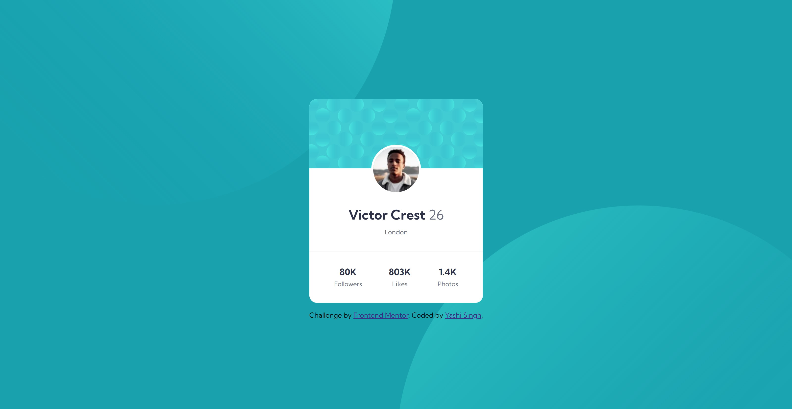

# Profile Card Component - Frontend Mentor Challenge

 

## Overview

This project is a solution to the **Profile Card Component** challenge on [Frontend Mentor](https://www.frontendmentor.io). The challenge involves creating a responsive profile card component that displays a user's profile information, including their name, age, location, and social media statistics.

## Screenshot

#### Desktop 

#### Mobile

## Project Links

- **Live Demo**: [Live](https://profile-card-component-frontend-yashi.netlify.app/)

## Technologies Used

- **HTML5**: For the structure of the webpage.
- **CSS3**: For styling the component, including the use of Flexbox for layout and custom properties for consistent theming.
- **Google Fonts**: The "Kumbh Sans" font family is used for typography.

## Features

- **Responsive Design**: The profile card is fully responsive, ensuring a seamless user experience across different screen sizes, including mobile devices.
- **Customizable**: The component uses CSS variables (custom properties) for easy customization of colors and other styles.
- **Clean Layout**: The layout is simple and clean, with a central focus on the profile information and statistics.

## Project Structure

The project files are organized as follows:

- **index.html**: Contains the markup for the profile card component.
- **styles.css**: Contains all the styles used for the component, including global styles, component-specific styles, and media queries.
- **images/**: Contains all the images used in the project, such as the background patterns and the profile picture.

## Customization

You can easily customize this component by modifying the CSS variables defined in the `:root` selector within `styles.css`. These variables control the primary and neutral colors used throughout the component.

## Credits

- Challenge by [Frontend Mentor](https://www.frontendmentor.io/challenges/profile-card-component-cfArpWshJ).
- Coded by [Yashi Singh](https://www.linkedin.com/in/yashi-singh-b4143a246).
