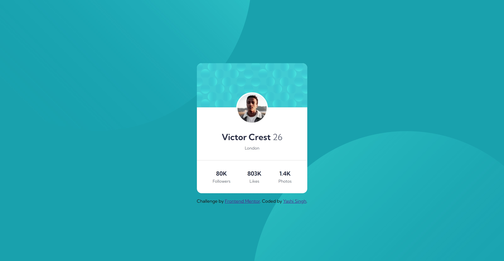

# Profile Card Component - Frontend Mentor Challenge


## Overview

This project is a solution to the **Profile Card Component** challenge on [Frontend Mentor](https://www.frontendmentor.io). The challenge involves creating a responsive profile card component that displays a user's profile information, including their name, age, location, and social media statistics.  

The solution is implemented using **HTML** and **SCSS** for cleaner, maintainable, and scalable styles.

## Screenshot

#### Desktop 


#### Mobile


## Project Links

- **Solution**: [Frontend Mentor](https://www.frontendmentor.io/solutions/profile-card-component-AgRVAdRRoZ)
- **Live Demo**: [Live](https://profile-card-component-frontend-yashi.netlify.app/)

## Technologies Used

- **HTML5**: For the structure of the webpage.
- **SCSS**: For styling the component, leveraging the power of variables, nesting, and mixins.
- **Google Fonts**: The "Kumbh Sans" font family is used for typography.

## Features

- **Responsive Design**: The profile card is fully responsive, ensuring a seamless user experience across different screen sizes, including mobile devices.
- **Clean SCSS Codebase**: The styles are modular and organized, making it easier to manage and extend.
- **Customizable**: The component uses SCSS variables for easy customization of colors, typography, and layout.

## Installation and Usage

To run this project locally and compile SCSS into CSS, follow these steps:

### Prerequisites

- Ensure you have [Node.js](https://nodejs.org/) and [npm](https://www.npmjs.com/) installed on your machine.
- Install a **SCSS compiler** globally or in your project directory.

### Installation

1. Clone the repository:

   ```bash
   git clone https://github.com/Yashi-Singh-9/Profile-Card-Component.git
   cd Profile-Card-Component
   ```

2. Install the required dependencies:

   ```bash
   npm install
   ```

3. Ensure that SCSS is installed. If it's not, you can install `sass` globally:

   ```bash
   npm install -g sass
   ```

### Running the SCSS Compiler

To compile the SCSS file into CSS, run the following command:

```bash
sass styles.scss styles.css
```

Alternatively, to watch for changes in real-time and recompile automatically:

```bash
sass --watch styles.scss:styles.css
```

### Open the Project Locally

1. Open `index.html` in your browser to view the component.  
2. You can use a live server (e.g., [Live Server](https://marketplace.visualstudio.com/items?itemName=ritwickdey.LiveServer)) for easier development.

## Project Structure

The project files are organized as follows:

```
.
├── design/          # Contains design screenshots
├── images/          # Contains images and assets
├── index.html       # The HTML file
├── styles.scss      # SCSS file with all styles
├── styles.scss.map  # Source map for debugging styles.scss
├── styles.css       # Compiled CSS file
└── README.md        # Documentation
```

## Customization

You can easily customize this component by editing the SCSS variables in the `styles.scss` file. These variables control primary colors, fonts, spacing, and other visual elements.

Example of SCSS Variables:
```scss
$primary-color: hsl(228, 45%, 44%);
$neutral-color: hsl(0, 0%, 98%);
$font-family: 'Kumbh Sans', sans-serif;
```

## Credits

- Challenge by [Frontend Mentor](https://www.frontendmentor.io/challenges/profile-card-component-cfArpWshJ).
- Coded by [Yashi Singh](https://www.linkedin.com/in/yashi-singh-b4143a246).